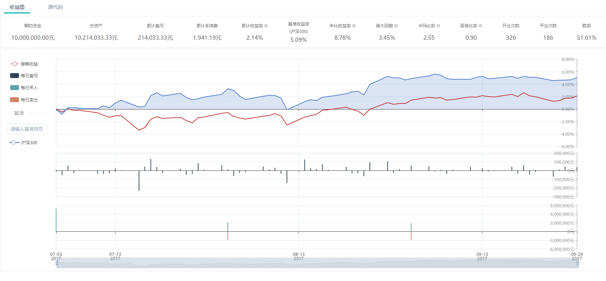

# 集合竞价选股(股票)
基于收盘价与前收盘价的选股策略

## 源码
```python
# coding=utf-8
from __future__ import print_function, absolute_import, unicode_literals
from gm.api import *
'''
本策略通过获取SHSE.000300沪深300的成份股数据并统计其30天内
开盘价大于前收盘价的天数,并在该天数大于阈值10的时候加入股票池
随后对不在股票池的股票平仓并等权配置股票池的标的,每次交易间隔1个月.
回测数据为:SHSE.000300在2015-01-15的成份股
回测时间为:2017-07-01 08:00:00到2017-10-01 16:00:00
'''
def init(context):
    # 每月第一个交易日的09:40 定时执行algo任务
    schedule(schedule_func=algo, date_rule='1m', time_rule='09:40:00')
    # context.count_bench累计天数阙值
    context.count_bench = 10
    # 用于对比的天数
    context.count = 30
    # 最大交易资金比例
    context.ratio = 0.8
def algo(context):
    # 获取当前时间
    now = context.now
    # 获取上一个交易日
    last_day = get_previous_trading_date(exchange='SHSE', date=now)
    # 获取沪深300成份股
    context.stock300 = get_history_constituents(index='SHSE.000300', start_date=last_day,
                                                end_date=last_day)[0]['constituents'].keys()
    # 获取当天有交易的股票
    not_suspended_info = get_history_instruments(symbols=context.stock300, start_date=now, end_date=now)
    not_suspended_symbols = [item['symbol'] for item in not_suspended_info if not item['is_suspended']]
    trade_symbols = []
    if not not_suspended_symbols:
        print('没有当日交易的待选股票')
        return
    for stock in not_suspended_symbols:
        recent_data = history_n(symbol=stock, frequency='1d', count=context.count, fields='pre_close,open',
                                fill_missing='Last', adjust=ADJUST_PREV, end_time=now, df=True)
        diff = recent_data['open'] - recent_data['pre_close']
        # 获取累计天数超过阙值的标的池.并剔除当天没有交易的股票
        if len(diff[diff > 0]) >= context.count_bench:
            trade_symbols.append(stock)
    print('本次股票池有股票数目: ', len(trade_symbols))
    # 计算权重
    percent = 1.0 / len(trade_symbols) * context.ratio
    # 获取当前所有仓位
    positions = context.account().positions()
    # 如标的池有仓位,平不在标的池的仓位
    for position in positions:
        symbol = position['symbol']
        if symbol not in trade_symbols:
            order_target_percent(symbol=symbol, percent=0, order_type=OrderType_Market,
                                 position_side=PositionSide_Long)
            print('市价单平不在标的池的', symbol)
    # 对标的池进行操作
    for symbol in trade_symbols:
        order_target_percent(symbol=symbol, percent=percent, order_type=OrderType_Market,
                             position_side=PositionSide_Long)
        print(symbol, '以市价单调整至权重', percent)
if __name__ == '__main__':
    '''
    strategy_id策略ID,由系统生成
    filename文件名,请与本文件名保持一致
    mode实时模式:MODE_LIVE回测模式:MODE_BACKTEST
    token绑定计算机的ID,可在系统设置-密钥管理中生成
    backtest_start_time回测开始时间
    backtest_end_time回测结束时间
    backtest_adjust股票复权方式不复权:ADJUST_NONE前复权:ADJUST_PREV后复权:ADJUST_POST
    backtest_initial_cash回测初始资金
    backtest_commission_ratio回测佣金比例
    backtest_slippage_ratio回测滑点比例
    '''
    run(strategy_id='strategy_id',
        filename='main.py',
        mode=MODE_BACKTEST,
        token='token_id',
        backtest_start_time='2017-07-01 08:00:00',
        backtest_end_time='2017-10-01 16:00:00',
        backtest_adjust=ADJUST_PREV,
        backtest_initial_cash=10000000,
        backtest_commission_ratio=0.0001,
        backtest_slippage_ratio=0.0001)
```


## 绩效图
